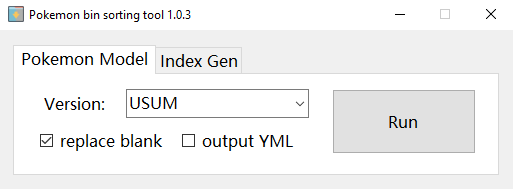
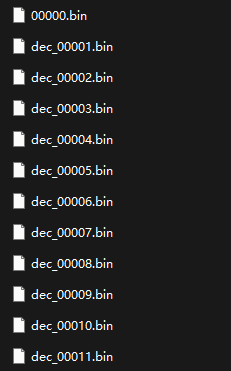
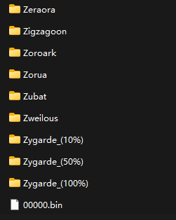
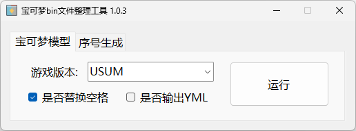

### Intro：

The pokemon-bin-sorting-tool is a tool used to organize Pokémon bin format models. It can classify existing bin files into folders named after Pokémon.

This tool is made for [Pokemon3DStoUnity](https://github.com/opeious/Pokemon3DStoUnity).

### Runtime Environment：

.net 6.0

### Support Game Version：

Pokémon Ultra Sun and Ultra Moon

### Manual：

Click Run, select the bin file directory, and wait for it to complete.

### Others：

The tool relies on a txt file that defines file categories, the `USUM.TXT` file comes from [Manurocker95](https://youtu.be/flt25aTOJ08)'s [Export tutorial](https://gbatemp.net/threads/export-your-pokemon-animated-models-from-3ds-to-unity-engine-3d.532962/)。

### bin file example：

#### Before：

##### After：

-----------------------------------------------------------------------------------------------------------------------------------

### 简介：

宝可梦bin文件整理工具是一款用来整理宝可梦bin格式模型的工具，它可以将已有的bin文件分类整理到以宝可梦命名的文件夹中。

本工具是为了配合[Pokemon3DStoUnity](https://github.com/opeious/Pokemon3DStoUnity)使用而制作的。

### 运行环境：

.net 6.0

### 支持游戏版本：

究极日月

### 使用流程：

点击运行，选择bin文件目录，然后等待其运行完成。

### 其他：

该工具依赖于一个定义文件类别的txt文件，提供的`USUM.TXT`来自于[Manurocker95](https://youtu.be/flt25aTOJ08)的[导出教程](https://gbatemp.net/threads/export-your-pokemon-animated-models-from-3ds-to-unity-engine-3d.532962/)。

### bin文件示例：

#### 整理前：

##### 整理后：

